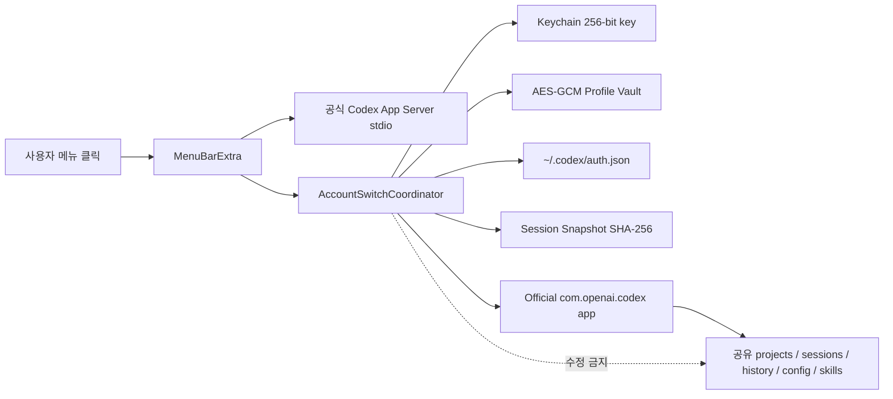
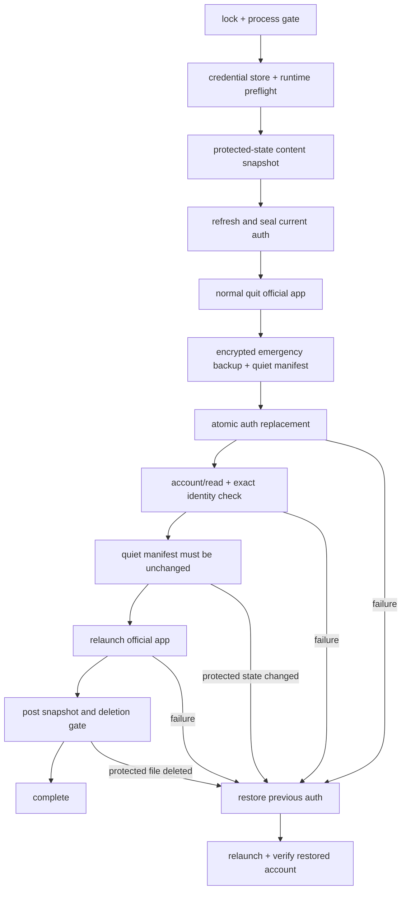

# Architecture

## 경계

공식 ChatGPT/Codex 앱은 프로젝트, thread, 터미널, 모델 호출, 승인, 샌드박스를 계속 담당합니다. Switcher는 인증 프로필, 공식 앱 lifecycle, 세션 보호 검증만 담당합니다.

## 모듈

- `AppServerConnection`: JSONL/JSON-RPC 2.0 초기화, 요청 correlation, 알림, timeout, 오류 redaction
- `CodexAppServerClient`: `account/read`, `account/logout`, `account/rateLimits/read`, `account/usage/read`
- `ProfileRateLimitProbe`: 암호화 프로필을 임시 `CODEX_HOME`에서 검증하고 Codex 남은 한도를 읽은 뒤 갱신 인증을 다시 봉인
- `AccountSwitchPreflight`: credential store, 파일 인증 runtime probe, 공식 앱 host-managed 호환 모드 판정
- `AccountRegistrationService`: 임시 `CODEX_HOME`, 파일 credential store, browser/device-code 로그인, 완료 알림, 즉시 암호화
- `SystemKeychainStore` / `ProcessCachedSecretKeyStore` / `CryptoVault`: Keychain 키, 프로세스 단위 키 캐시와 AES-GCM 봉인
- `EncryptedProfileStore`: 여러 프로필의 메타데이터와 암호문 저장
- `AtomicFileWriter`: `0600`, `fsync`, atomic rename
- `SwitchLock`: 프로세스 내부 registry + 프로세스 간 `fcntl` write lock
- `CodexProcessScanner`: 공식 앱 자식과 standalone Codex 작업 구분
- `SessionSnapshotter`: 보호 대상의 경로·크기·수정 시각·SHA-256 비교
- `OfficialAppController`: Bundle Identifier 기반 정상 종료, 승인된 강제 종료, NSWorkspace 재실행
- `OfficialAppAccountController`: Guided Switch에서 System Events로 공식 앱의 표준 로그아웃 메뉴 실행
- `RecoveryStore`: 마지막 정상 인증의 암호화 백업·복원
- `ContinuityTestStore` / `SessionMarkerFinder`: CAS marker와 실제 사용자 판정 기록

## 등록 흐름

1. 소유자 전용 임시 디렉터리를 `CODEX_HOME`으로 지정합니다.
2. `cli_auth_credentials_store = "file"`을 명시합니다.
3. 번들 Codex App Server를 시작하고 `initialize` → `initialized` 순서를 지킵니다.
4. `account/login/start`의 공식 browser 또는 device-code 흐름만 엽니다.
5. `account/login/completed.success`와 `account/read`를 확인합니다.
6. 임시 `auth.json`을 구조 검증하고 메모리에서 AES-GCM으로 봉인합니다.
7. 임시 평문을 best-effort overwrite·unlink하고 임시 홈 전체를 제거합니다.

## 전환 트랜잭션

공식 앱 종료 후부터 재실행 전까지는 인증 파일 외 보호 상태가 하나도 바뀌지 않아야 합니다. 이 조용한 구간은 내용 전체를 다시 해시하지 않고 경로·종류·크기·수정 시각 manifest로 검사하며, 삭제·수정·추가가 하나라도 있으면 롤백합니다. 재실행 이후 보호 파일의 내용 변경은 정상 상태 저장일 수 있어 경고로 기록하고, 파일 삭제만 destructive change로 간주해 롤백합니다. 인증 파일은 비교 집합에 포함하지 않습니다.

## 호스트 관리형 인증

공식 앱이 `chatgptAuthTokens` 같은 호스트 관리형 인증을 사용해도 private token을 읽거나 주입하지 않습니다. 대신 유효한 파일 인증과 새 App Server의 계정 응답이 확인되면 `auth.json` 교체를 호환 모드로 허용합니다. 별도 App Server 검증은 공식 데스크톱 호스트가 같은 계정을 수용했다는 증거가 아니므로, 재실행 후 실제 계정은 사용자가 확인합니다. 적용되지 않았을 때만 Guided Switch로 공식 앱의 표준 로그아웃 메뉴를 실행합니다.

남은 한도 조회도 같은 경계를 지킵니다. 현재 `auth.json` 계정은 공유 `CODEX_HOME`의 새 App Server에서 직접 조회하고, 정확한 이메일이 일치하는 프로필 행에도 같은 값을 표시합니다. 등록된 나머지 프로필은 무작위 임시 홈에서 각각 `account/read`와 `account/rateLimits/read`를 실행하고 평문 인증을 즉시 제거합니다. host-managed 화면의 상단 값은 `auth.json 인증 기준`으로 표시하며 공식 앱 내부 계정의 값이라고 표시하지 않습니다. 만료되거나 검증할 수 없는 프로필은 수치를 추정하지 않고 인증 갱신 상태를 노출합니다.

팝오버 생명주기에 연결된 자동 갱신 task가 열릴 때 즉시, 이후 30초 간격으로 위 한도 조회만 반복합니다. 환경 전수 검사와 세션 스냅샷은 반복하지 않으며, 팝오버가 닫혀 SwiftUI task가 취소되면 다음 조회도 중단됩니다. 계정 전환이나 복구 작업이 진행 중일 때는 자동 갱신을 건너뜁니다.

전환이 시작될 때 이미 진행 중인 한도 조회가 있으면 완료될 때까지 기다린 뒤 전환 트랜잭션을 시작합니다. 대상 인증 교체 뒤에는 `account/read(refreshToken: false)`와 저장된 전체 이메일 일치로 계정을 검증합니다. 프로필 임시 홈과 공유 홈에서 같은 회전형 refresh token을 연속 강제 갱신해 정상 인증을 폐기하는 경합을 피하기 위한 불변식입니다.
