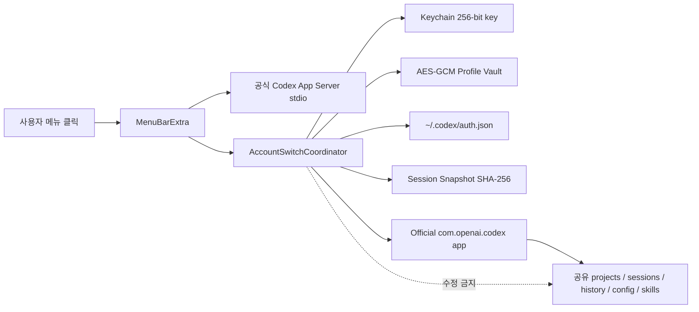
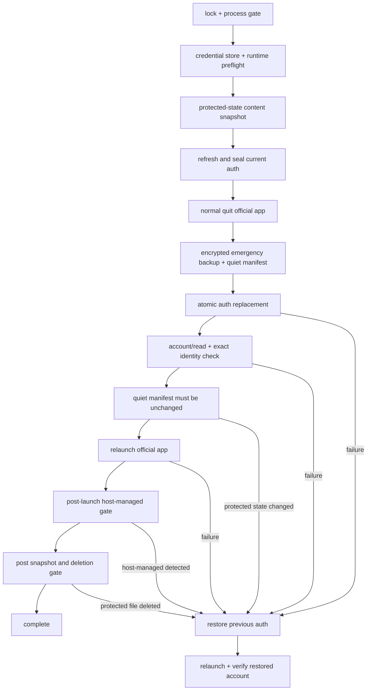

# Architecture

## 경계

공식 ChatGPT/Codex 앱은 프로젝트, thread, 터미널, 모델 호출, 승인, 샌드박스를 계속 담당합니다. Switcher는 인증 프로필, 공식 앱 lifecycle, 세션 보호 검증만 담당합니다.

## 모듈

- `AppServerConnection`: JSONL/JSON-RPC 2.0 초기화, 요청 correlation, 알림, timeout, 오류 redaction
- `CodexAppServerClient`: `account/read`, `account/logout`, `account/rateLimits/read`, `account/usage/read`
- `AccountSwitchPreflight`: credential store, 파일 인증 runtime probe, 공식 앱 host-managed 인증 전·후 차단
- `AccountRegistrationService`: 임시 `CODEX_HOME`, 파일 credential store, browser/device-code 로그인, 완료 알림, 즉시 암호화
- `SystemKeychainStore` / `ProcessCachedSecretKeyStore` / `CryptoVault`: Keychain 키, 프로세스 단위 키 캐시와 AES-GCM 봉인
- `EncryptedProfileStore`: 여러 프로필의 메타데이터와 암호문 저장
- `AtomicFileWriter`: `0600`, `fsync`, atomic rename
- `SwitchLock`: 프로세스 내부 registry + 프로세스 간 `fcntl` write lock
- `CodexProcessScanner`: 공식 앱 자식과 standalone Codex 작업 구분
- `SessionSnapshotter`: 보호 대상의 경로·크기·수정 시각·SHA-256 비교
- `OfficialAppController`: Bundle Identifier 기반 정상 종료, 승인된 강제 종료, NSWorkspace 재실행
- `RecoveryStore`: 마지막 정상 인증의 암호화 백업·복원
- `ContinuityTestStore` / `SessionMarkerFinder`: CAS marker와 실제 사용자 판정 기록

## 등록 흐름

1. 소유자 전용 임시 디렉터리를 `CODEX_HOME`으로 지정합니다.
2. `cli_auth_credentials_store = "file"`을 명시합니다.
3. 번들 Codex App Server를 시작하고 `initialize` → `initialized` 순서를 지킵니다.
4. `account/login/start`의 공식 browser 또는 device-code 흐름만 엽니다.
5. `account/login/completed.success`와 `account/read`를 확인합니다.
6. 임시 `auth.json`을 구조 검증하고 메모리에서 AES-GCM으로 봉인합니다.
7. 임시 평문을 best-effort overwrite·unlink하고 임시 홈 전체를 제거합니다.

## 전환 트랜잭션

공식 앱 종료 후부터 재실행 전까지는 인증 파일 외 보호 상태가 하나도 바뀌지 않아야 합니다. 이 조용한 구간은 내용 전체를 다시 해시하지 않고 경로·종류·크기·수정 시각 manifest로 검사하며, 삭제·수정·추가가 하나라도 있으면 롤백합니다. 재실행 이후 보호 파일의 내용 변경은 정상 상태 저장일 수 있어 경고로 기록하고, 파일 삭제만 destructive change로 간주해 롤백합니다. 인증 파일은 비교 집합에 포함하지 않습니다.

## 호스트 관리형 인증

공식 앱이 `chatgptAuthTokens` 같은 호스트 관리형 인증을 사용하거나 공유 `auth.json` 변경을 무시하면 private token을 읽거나 주입하지 않습니다. 전환 전과 앱 재실행 후 모두 프로세스 모드를 검사하고, 원클릭 전환을 비활성화하거나 자동 롤백합니다. Guided Switch는 공식 앱을 열어 사용자가 앱 계정 메뉴에서 직접 전환하도록 안내합니다. 실제 데스크톱 세션 수용 여부는 Continuity Test로만 판정합니다.
